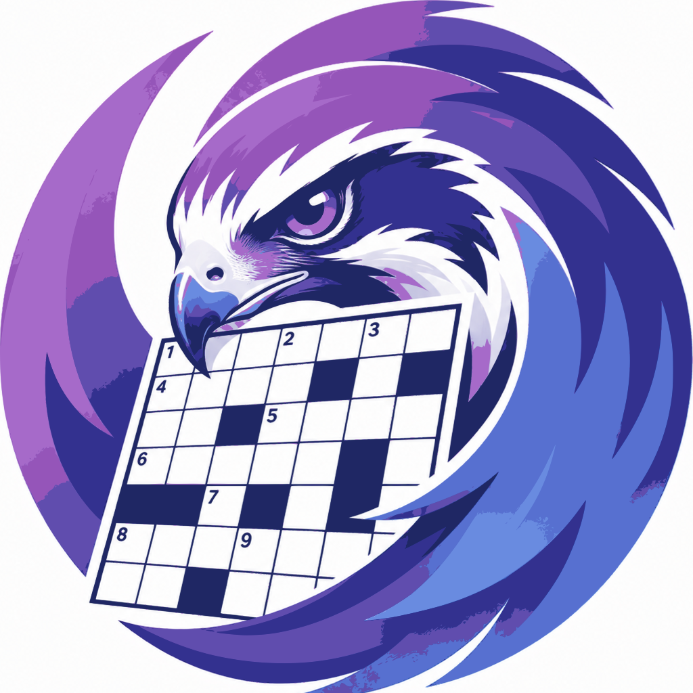

# CrossWordFalcon



CrossWordFalcon generates crossword grids, complete with clues, straight
from a web page — in French, English, German, Spanish, or Italian. Pick a
language, a size, and a difficulty level, and the app builds a full grid.

## What you need

- **Python 3** installed on your computer.
- A small local language model generates the clues by default, and needs no
  account or key — see [Generating clues](#generating-clues) below for the
  (optional) cloud alternative.

## Installation (one-time setup)

From a terminal, at the project root:

```bash
./Install.sh
```

This script prepares everything the app needs to run.

## Generating clues

First, create your own local settings file (this one is never sent to
GitHub):

```bash
cp env_default.sh env.sh
```

By default, clues are generated by a language model that runs locally on
your machine (no internet account needed). Start it once, in its own
terminal:

```bash
pip install -r requirements-llama.txt   # first time only (builds llama.cpp)
./run_llm.sh
```

The first start downloads the model (a few GB), which can take a while
depending on your connection. It runs on a graphics card if you have one
(including Apple Silicon Macs), and falls back to your CPU otherwise —
slower, but it works.

If you'd rather use a cloud service instead of running a model locally,
open `env.sh` at the project root and follow the commented instructions
there to switch to a cloud provider (e.g. Mistral, which offers a free API
key at [console.mistral.ai](https://console.mistral.ai/)). Either way, never
share `env.sh` or its contents — once you've put a real key in it, it holds
a personal secret, like a password.

## Running the app

```bash
./run_Falcon.sh
```

Then open your browser at: **http://127.0.0.1:8000**

This script also takes care of cleanly stopping any version of the app that
might already be running before starting a new one — feel free to rerun it
as often as you like.

## Using the app

On the page:

1. Choose a **language** (the interface itself switches to that language
   too), a **width**, a **height** (15×10 by default), and a **difficulty
   level** ("Easy" uses everyday vocabulary, "Hard" allows rarer words).
2. Click **"Generate grid"** (the button's own label follows your chosen
   language). Larger grids can take up to thirty seconds or so to build —
   that's normal, just wait for it.
3. An empty grid appears on the left, with a small number in the cells
   where each word starts, ready to be filled in. Clues follow the usual
   crossword format: horizontal ("Horizontalement") clues appear to the
   right of the grid, listed line by line; vertical ("Verticalement")
   clues appear below, spanning the full width in two columns, listed
   column by column. When several words start on the same line (or the
   same column), their clues are grouped into a single line of text, for
   example:

   ```
   3. Petit mammifère domestique. — 5. Boisson chaude au petit-déjeuner.
   ```

### Filling in the grid

Click a white cell to select it (it turns blue), then type letters on your
keyboard:

- A **lowercase** letter fills the cell and moves the selection to the next
  cell **to the right**.
- An **uppercase** letter (Shift or Caps Lock) fills the cell and moves the
  selection **downwards** instead — handy for typing a vertical word.

Two buttons above the grid help you check your progress:

- **Solution** reveals every letter of the finished grid; click it again to
  go back to your own answers (nothing you typed is lost).
- **Vérification** highlights what you've filled in so far: correct letters
  turn green, wrong ones turn red; click it again to return to the plain
  grid.

## Going further

A technical document, for developers who want to understand or modify how
the app works internally, will be added separately.
